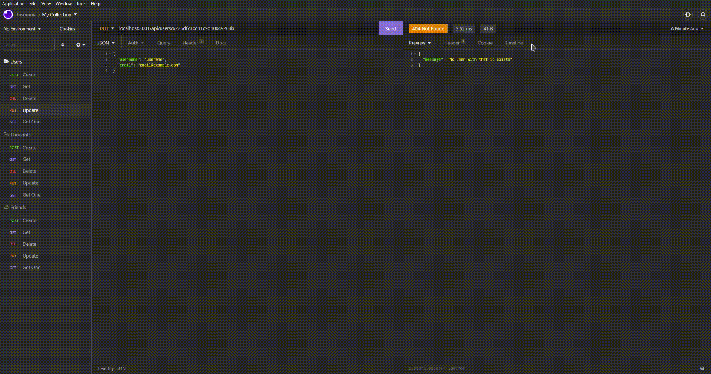

<!-- proj name -->

# ShowerThoughtsAPI

<!-- project shields -->

<!-- toc -->

## Table of Contents

- [ShowerThoughtsAPI](#title)
- [About ShowerThoughtsAPI](#about-proj)
- [Getting Started](#getting-started)
- [Usage](#Usage)
- [Testing](#testing)
- [Contributing](#contributing)
- [License](#license)
- [Contact Me](#contact-me)

<!-- about project -->

## About ShowerThoughtsAPI

ShowerThoughtsAPI is a demonstration of a backend API to store all data. The code used in this project utilizes MongoDB, allowing for highspeed data returns and large data caps. This project utilized MongoDB for databasing, Mongoose for data modeling, and Express.JS for routing.

<!-- Getting Started -->

## Getting Started
This is how you can get started using ShowerThoughtsAPI locally. Begin by following these instructions.
### Installation

To install ShowerThoughtsDB clone the repository to any directory on your local machine, then use `npm i` to install all node-module packages.

<!-- Usage -->

## Usage

To use ShowerThoughtsDB run in a terminal window in the root folder, `npm start` to begin the server, from there use a program such as [Insomnia](https://insomnia.rest) to navigate users, thoughts, and friends utilizing id values. For further explanation please refer to the demonstration video.

<!-- Testing -->

## Testing

To test ShowerThoughtsAPI follow the installation instructions, then the usage instructions. From there navigate posting, putting, getting and deleting users, friends, thoughts and reactions through:
 `localhost:3001/api/users` (Users)
  `localhost:3001/api/'userId'/friends/'userId` (Friends)
 `localhost:3001/api/thoughts/'thoughtId` (Thoughts)
 `localhost:3001/api/thoughts/'thoughtId'/reactions` (Reactions)
 

<!-- Contributing -->

## Contributing

To contribute to this project please email me or post an issue describing the issue you are having.

<!-- License -->

<!-- Contact Me -->

## Contact Me
- [zortro](https://github.com/zortro)
- ben.r.dominguez@gmail.com

This readme file was generated using [ReadMe Generator](https://github.com/zortro/readme-generator/)